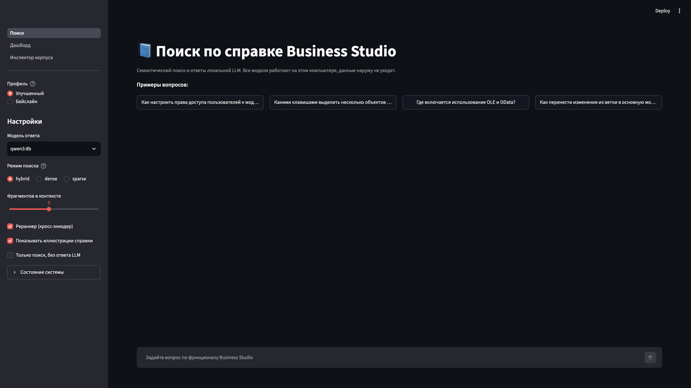
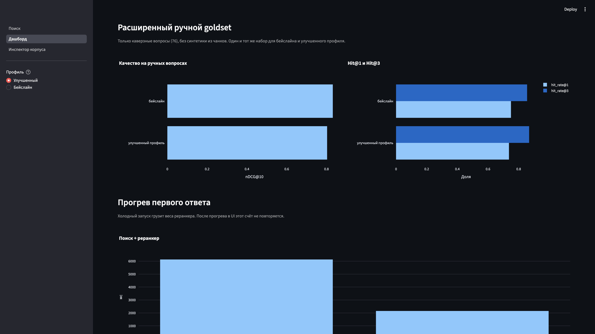

# bs-semantic

Локальный семантический поиск и RAG по официальной справке Business Studio. Всё крутится on-premise: эмбеддинги, векторный индекс, реранкер и LLM не отправляют текст во внешние API.

Проект сделан как демо для тестового задания: система отвечает на каверзные вопросы по функционалу программы и показывает, из каких файлов справки взят ответ. Выбор чанкинга, модели эмбеддингов и схемы поиска обоснован бенчмарками (`bsrag bench`, дашборд в UI).

## Архитектура

```
DokuWiki (.txt)  →  очистка разметки  →  чанки  →  Qdrant (dense + BM25)
                                                      ↓
вопрос  →  гибридный поиск + RRF  →  кросс-энкодер  →  локальная LLM (Ollama)
                                                      ↓
                              ответ со ссылками [1][2] и путём к файлу справки
```

| Слой | Что взяли | Зачем |
|---|---|---|
| Парсер | свой `dokuwiki2md` (~200 строк) | Готовых парсеров под плагины Business Studio нет |
| Чанкинг | LangChain `MarkdownHeaderTextSplitter` + `RecursiveCharacterTextSplitter` | Режем по оглавлению справки, не по «каждые N символов» |
| Эмбеддинги | `deepvk/USER-bge-m3` | Лучший nDCG и Hit@3 на каверзных вопросах среди 7 моделей |
| Индекс | Qdrant embedded | Dense + sparse BM25 в одной коллекции, RRF из коробки |
| Реранкер | `BAAI/bge-reranker-v2-m3`, fp16 на MPS | Главный рычаг Hit@1 и nDCG (~2 с тёплый поиск) |
| LLM | Ollama: Qwen3 8B / Gemma3 12B QAT / Vikhr-Nemo 12B | Полностью локальный инференс, ответы только по фрагментам |
| Оценка | `ranx` (nDCG, MRR, Hit@k) + локальный LLM-судья | Сравнение стратегий без облачных API |
| UI | Streamlit | Поиск, дашборд экспериментов, инспектор чанков |

Парсер справки написан вручную: готовые конвертеры DokuWiki не понимают плагины Business Studio. Остальной пайплайн собран из LangChain, Qdrant, FastEmbed и Ollama. В парсере отдельно разобраны `{{bslink>…}}`, `<startTableBox>`, объединение строк `:::`, подписи рисунков и возврат шапки таблицы оторванным чанкам.

## Что сломалось бы без своего парсера

Справка — это DokuWiki с самописными плагинами Business Studio, не «чистый markdown».

- **`{{bslink>Главное меню → Отчеты → …\|ShowRibbonPageOrItem?GUID}}`** — видимый текст это путь по меню, после `|` GUID. Наивная очистка выкидывает ровно то, по чему ищут «где это включается».
- **`<startTableBox>…<endTableBox|Таблица 1. …>`** — подпись стоит *после* таблицы. При нарезке она отрывается, а таблица рвётся посередине.
- **`:::`** в таблице горячих клавиш — объединение строк. Без наследования F1/Ctrl+R остаются только у первой строки.
- Картинки `[{{ path\|Рисунок 1. … }}]`: файл не нужен эмбеддеру, подпись — нужна.
- BOM у 51 страницы прятал заголовок первого уровня.
- `[<contextnavigator>]`, YouTube-iframe, страницы-оглавления из одних ссылок.

После очистки: 573 рабочие страницы, ~2.5 млн символов, остатков разметки нет.

## Запуск

Нужны Python 3.11–3.12, [uv](https://docs.astral.sh/uv/), [Ollama](https://ollama.com/) и ~20 ГБ на диск под модели.

```bash
git clone https://github.com/<you>/bs-semantic.git
cd bs-semantic
uv sync --extra dev

# Полный комплект справки положите в bs_6/docs/data/pages
# (или работайте на выборке из репозитория)
# configs/sample.yaml указывает на data/sample_corpus

ollama pull qwen3:8b
# опционально:
# ollama pull gemma3:12b-it-qat
# ollama create vikhr-nemo-12b -f models/vikhr-nemo.Modelfile

uv run bsrag doctor
uv run bsrag ingest                 # DokuWiki → Markdown
uv run bsrag index                  # чанки + Qdrant
uv run bsrag ask "Какой горячей клавишей вызвать окно Права доступа?"
uv run bsrag ui                     # http://localhost:8501
```

На выборке из репозитория:

```bash
uv run bsrag ingest --config configs/sample.yaml
uv run bsrag index --config configs/sample.yaml
uv run bsrag ask --config configs/sample.yaml "Как открыть окно фильтра?"
```

Первый `index` скачивает эмбеддинг-модель с Hugging Face (дальше всё локально).

## Интерфейс

`uv run bsrag ui` поднимает Streamlit на http://localhost:8501. В сайдбаре переключатель **Бейслайн / Улучшенный**: бейслайн — `configs/baseline.yaml` и исходный индекс, улучшения его не затирают. Три страницы:

- **Поиск** — вопрос, ответ локальной LLM и цитаты с путём к файлу справки.
- **Дашборд** — графики `reports/benchmarks.csv`: нарезка, эмбеддинги, схема поиска, LLM.
- **Инспектор корпуса** — исходный DokuWiki, очищенный markdown и чанки одной страницы.







## Команды

| Команда | Назначение |
|---|---|
| `bsrag ingest` | Очистка разметки, `data/processed/pages.jsonl` |
| `bsrag index` | Нарезка и индекс |
| `bsrag search "…"` | Только поиск, без LLM |
| `bsrag ask "…"` | Ответ со ссылками на файлы справки |
| `bsrag chat` | Диалог в терминале |
| `bsrag goldset` | Собрать золотой набор вопросов |
| `bsrag bench [chunking\|embeddings\|retrieval\|llm\|ablations\|improve\|warmup\|goldset_expand\|all]` | Эксперименты → `reports/benchmarks.csv` |
| `bsrag ui` | Streamlit |
| `bsrag doctor` | Проверка окружения |

## Как ставили эксперимент

Полный перебор «нарезка × модель × поиск × LLM» смешал бы эффекты. Поэтому **один фактор за этап**: меняем одну группу параметров, остальное на лучшем известном. Улучшения этапа E (таблицы, раскрытие запроса, отказ от крошек) на A–C выключены. Реранкер на чанкинге и эмбеддингах выключен — иначе сглаживает разницу.

**Goldset.** 76 ручных вопросов (пользовательские формулировки по страницам справки, не копипаст заголовка, эталон из текста, не из выдачи) + 12 ловушек (Telegram, цена, 2FA, Camunda, …). Синтетика из чанка в `goldset.jsonl` есть, в метрики A–E не входит: слова вопроса уже лежат в чанке и завышают nDCG.

**Метрики поиска** — page-level nDCG@10, MRR@10, Hit@k (`ranx`), n=76. Оценка по странице, не по чанку: иначе 256 и 512 несравнимы. При p≈0.75 стандартная ошибка Hit@1 на 76 вопросах ±5 п.п. (один вопрос = 1.3 пункта). LLM отдельно: обоснованность/полнота (локальный судья другой семьи), корректность ссылок, отказ на ловушках, p50/p95.

Все цифры ниже — этот набор, этот протокол. Дашборд читает `reports/benchmarks.csv`.

### Этап 0. Парсер

**Идея.** Готовый dokuwiki→md не знает плагины Business Studio.

**Гипотеза.** Если выкинуть разметку «как HTML», пропадёт то, по чему ищут: путь меню, клавиша, подпись таблицы.

**Эвристики.** `{{bslink>…|GUID}}` — видимый путь, не GUID. `:::` — наследовать ячейку вниз. Подпись `<endTableBox>` и подпись рисунка — в текст, файл картинки — нет. BOM с 51 страницы снять, иначе пропадает H1. Оглавления из одних ссылок выкинуть.

**Проверка.** Не nDCG, а тесты на живых конструкциях + инспектор корпуса (слева сырой DokuWiki, справа то, что уходит в индекс). Без `:::` вопрос «какой клавишей Права доступа?» в индексе неотвечаем.

**Вердикт.** Гипотеза подтверждена конструкциями корпуса. Свой парсер (~200 строк). Остальной пайплайн — библиотеки.

### Этап A. Чанкинг

**Идея.** Резать по оглавлению справки, не «каждые N символов». LangChain: `MarkdownHeaderTextSplitter` + `RecursiveCharacterTextSplitter`. Бюджет токенов минус шапка раздела; оторванной таблице возвращаем заголовок колонок.

**Гипотезы.** (1) 256 лучше 512 на каверзных. (2) оверлап 15% лучше 0% и 30%. (3) parent-document / весь корпус rows / отказ от крошек дадут плюс.

**Протокол.** Сетка 256/384/512 × 0/15/30% на `e5-base`, без реранкера, без таблиц. Абляции — на 512/15%, отдельные коллекции.

**Сетка (n=76).**

| | nDCG@10 | Hit@1 | Hit@3 | чанков |
|---|---|---|---|---|
| 256 / 15% | **0.738** | **0.632** | 0.829 | 4638 |
| 384 / 15% | 0.683 | 0.539 | 0.789 | 3148 |
| **512 / 15%** | 0.723 | 0.553 | 0.816 | **2569** |

384 слабее. У 512 оверлап 0% почти как 15% (nDCG 0.721), 30% хуже (0.693).

**Абляции на 512/15%.** header-aware: 0.723 / 0.553 / 0.816. fixed: Hit@1 0.618, Hit@3 0.776 — заголовки нужны в тройке. parent-document совпал с header (тот же embed-текст). rows: 0.707. без крошек: Hit@3 0.855 при том же Hit@1.

**Вердикт.** (1) частично: 256 выигрывает Hit@1 на слабом e5 без реранкера; nDCG близкий, индекс почти вдвое больше. Зазор закрывает этап C, не размер чанка → **512/15%**. (2) 15% — разумный центр, не большой выигрыш. (3) parent — нет; rows как весь корпус — нет; крошки мешают Hit@3, выключим на USER на этапе E.

### Этап B. Эмбеддинги

**Идея.** Сравнить модели на зафиксированной нарезке 512/15%, без реранкера.

**Гипотеза.** Русскоязычный `deepvk/USER-bge-m3` лучше e5-large и лучше универсального bge-m3 на этой справке.

**Цифры (n=76).**

| Модель | nDCG@10 | Hit@1 | Hit@3 |
|---|---|---|---|
| **USER-bge-m3** | **0.777** | **0.658** | **0.882** |
| BERTA | 0.767 | 0.645 | 0.842 |
| e5-large | 0.766 | 0.632 | 0.842 |
| bge-m3 | 0.742 | 0.605 | 0.855 |
| e5-base | 0.723 | 0.553 | 0.816 |
| e5-small | 0.700 | 0.539 | 0.789 |
| ru-en-RoSBERTa | 0.685 | 0.513 | 0.789 |

У e5/RoSBERTa обязательны префиксы query/passage. Qdrant не меняем: на ~2500 чанках поиск полный, ANN не определяет качество.

**Вердикт.** Гипотеза подтверждена. USER-bge-m3.

### Этап C. Схема поиска

**Идея.** Dense + BM25 в одной коллекции, RRF из коробки, затем кросс-энкодер.

**Гипотезы.** (1) Hybrid лучше dense и BM25. (2) Реранкер даст основной скачок качества. (3) 32 кандидата лучше 16. (4) Свои веса «короткий запрос → BM25» лучше равного RRF.

**Цифры на USER-bge-m3 (n=76).**

| Схема | nDCG@10 | Hit@1 | Hit@3 | p50 |
|---|---|---|---|---|
| BM25 | 0.622 | 0.474 | 0.697 | 28 мс |
| dense | 0.713 | 0.592 | 0.803 | 36 мс |
| hybrid | 0.777 | 0.658 | **0.882** | 61 мс |
| dense + реранкер | 0.798 | 0.711 | 0.868 | 2.3 с |
| **hybrid + реранкер** | **0.832** | **0.750** | 0.855 | 2.0 с |

Прогрев поиска: холодный 6.3 с → тёплый 2.3 с.

(3) и (4) мерили на этапе E, тот же n=76, поверх этой опоры: 32 кандидата — nDCG 0.826, Hit@3 0.882, 3.8 с. Взвешенный RRF — nDCG 0.780, Hit@1 0.697.

**Вердикт.** (1) да. (2) да для Hit@1 и nDCG; Hit@3 у hybrid без реранкера чуть выше (эталон чаще первый, иногда вылетает из тройки) — не прячем. (3) нет. (4) нет. **Hybrid + реранкер, 16 кандидатов.** Это и есть замороженный бейслайн.

### Этап D. LLM

**Идея.** Ответ только по фрагментам, цитаты `[1][2]`, отказ если в справке нет. `think: false`.

**Гипотезы.** (1) Более крупная модель даст лучшие ответы. (2) На вопросах вне справки система откажется, а не выдумает. Ограничение: отказы важнее полноты.

**Цифры (76 ручных + 12 ловушек).** Судья — другая семья: Gemma судит Qwen/Vikhr, Qwen судит Gemma.

| | p50 | citation | cited gold | ответ на ручных | отказ на ловушках | обоснованность | полнота |
|---|---|---|---|---|---|---|---|
| **Qwen3 8B** | **19.5 с** | **1.00** | **0.83** | 0.92 | **1.00** | **0.99** | **0.99** |
| Gemma3 12B | 30.1 с | 0.99 | 0.82 | **0.97** | 1.00 | 0.97 | 0.91 |
| Vikhr-Nemo 12B | 27.6 с | 0.87 | 0.71 | 0.92 | 1.00 | 0.98 | 0.97 |

cited gold 0.83 рядом с Hit@3 поиска: модель ссылается на найденное, не выдумывает источник. Qwen отказался на 6 из 76 ручных — для справки вендора это калибровка, не баг. Судья — локальная LLM, не человек.

**Вердикт.** (1) нет: крупнее ≠ лучше. (2) да: 12/12 ловушек у всех трёх. **Qwen3 8B.** Прогрев не лечит ~20 с генерации.

### Этап E. Надстройки поверх опоры C

**Идея.** Header-aware режет таблицу посередине. Даже с возвратом шапки «Ctrl+R» тонет среди соседних строк. Плюс крошки полного пути в эмбеддере и лексическое раскрытие запроса без LLM.

**Гипотезы.** (1) Вторая коллекция строк таблиц даст больше, чем ещё одна эмбеддинг-модель. (2) Весь корпус в `rows` хуже dual-index. (3) Без крошек лучше. (4) Лексическое раскрытие («клавиш» → «горячая клавиша») поможет.

**Цифры поверх опоры C = бейслайна (n=76).**

| Вариант | nDCG@10 | Hit@1 | Hit@3 |
|---|---|---|---|
| опора C / **бейслайн** | **0.832** | **0.750** | 0.855 |
| + раскрытие запроса | 0.833 | 0.750 | 0.855 |
| + без крошек | 0.831 | 0.750 | **0.895** |
| + индекс таблиц | 0.815 | 0.750 | 0.855 |
| весь корпус rows | 0.812 | 0.724 | 0.868 |
| всё вместе / **улучшенный** | 0.803 | 0.737 | 0.868 |

Ранг эталона совпал на **69/76**.

**Вердикт.** (1) нет: dual-index nDCG не поднимает. (2) да, rows как весь корпус хуже опоры. (3) да для Hit@3 (+4 п.п.). (4) нет, шум +0.001. **Бейслайн заморожен** (`configs/baseline.yaml`). Улучшенный (`default.yaml`) — nobc + таблицы + раскрытие: Hit@3 чуть выше, nDCG/Hit@1 чуть ниже. Оба в UI, не «вместо». Улучшенный по умолчанию как стенд для узких фактов из таблиц, не как победитель по nDCG.

## Честность эксперимента

Протокол фиксировали до интерпретации. Отрицательные результаты не вычеркнуты.

- **Одна ось за этап.** Иначе нельзя сказать, что сработало.
- **Эталон не из выдачи.** Страницы в `manual.yaml` — по тексту справки.
- **Синтетика не в метриках.** Авто из чанка завышает nDCG.
- **Бейслайн не затирается.** Отдельный yaml, отдельная коллекция, CSV рядом.
- **Отвергнуто и оставлено в отчёте.** 32 кандидата, взвешенный RRF, dual-index таблиц, весь корпус в `rows`, parent-document «ради эмбеддера», «больше LLM — лучше».
- **Fusion на goldset не учили.** 76 примеров — переобучение. Эвристика проиграла равному RRF Qdrant.
- **Метрика page-level.** Верная страница ≠ верная строка таблицы.
- **LLM-судья — локальная модель.** Citation 1.0 ≠ «идеальный ответ».

Что этим *не* доказано: что улучшенный лучше бейслайна на всех метриках (они в пределах шума / разные оси); что ответ читает нужную строку таблицы; что цифры воспроизведутся у другого человека без полного корпуса в git.

## Почему остановились здесь

Не потому что «больше нельзя», а потому что следующий шаг уже не меняет тезис, который можно защитить.

1. **Плато поиска.** Бейслайн и улучшенный расходятся на ~1 вопрос. 69/76 — тот же ранг. Новая эмбеддинг-модель — лотерея 0…+0.04 nDCG, как e5→USER, или минус.
2. **Учить нечего.** Fusion, реранкер, пороги на 76 примерах — переобучение. Weighted RRF это показал.
3. **LLM-rewrite и агент** — +2–4 с и риск сломать ловушки. Задание — поиск со ссылками, не ассистент.
4. **Смена Qdrant** не поднимет nDCG: чанков ~2500, поиск полный.
5. **~20 с генерации** — инференс 8B. Лечится UX (сначала источники), не новой архитектурой.
6. **Цельный рассказ.** Парсер, однофакторные бенчи на одном goldset, отвергнутые гипотезы, два профиля рядом.

Дальше — если будет «прод»: Qdrant server (UI и bench не дерутся за lock), 150+ ручных, search-first UI, более быстрый реранкер.

| | Бейслайн | Улучшенный (по умолчанию) |
|---|---|---|
| Конфиг | `configs/baseline.yaml` | `configs/default.yaml` |
| Коллекция | `…_512_15_markdown` | `…_512_15_markdown_nobc` + `_tables` |
| Крошки в эмбеддере | да | нет |
| Раскрытие запроса | нет | да |
| Индекс таблиц | нет | да |
| Прогрев UI | нет | да |

Переключение в сайдбаре UI или `uv run bsrag ask --config configs/baseline.yaml "…"`.

## Структура

```
src/bsrag/           ядро: парсер, чанкинг, индекс, RAG, CLI
app/                 Streamlit: поиск, дашборд, инспектор корпуса
configs/             default.yaml (улучшенный), baseline.yaml, sample.yaml
docs/                план презентации и скриншоты UI
reports/             benchmarks.csv и снимок benchmarks_baseline.csv
data/goldset/        ручная разметка (manual.yaml); goldset.jsonl в git не входит
data/sample_corpus/  небольшая выборка справки для воспроизведения демо
tests/               разметка DokuWiki, плагины, лексическое раскрытие
scripts/             выгрузка выборки, дымовые прогоны
```

Полный корпус справки в git не кладётся (проприетарный контент). Для демо в репозитории — 25 страниц, покрывающих таблицы, `bslink`, горячие клавиши и типичные каверзные вопросы.

## Лицензия

Код — MIT. Тексты и иллюстрации справки Business Studio принадлежат правообладателю и в публичный репозиторий не входят, кроме явно указанной учебной выборки.
