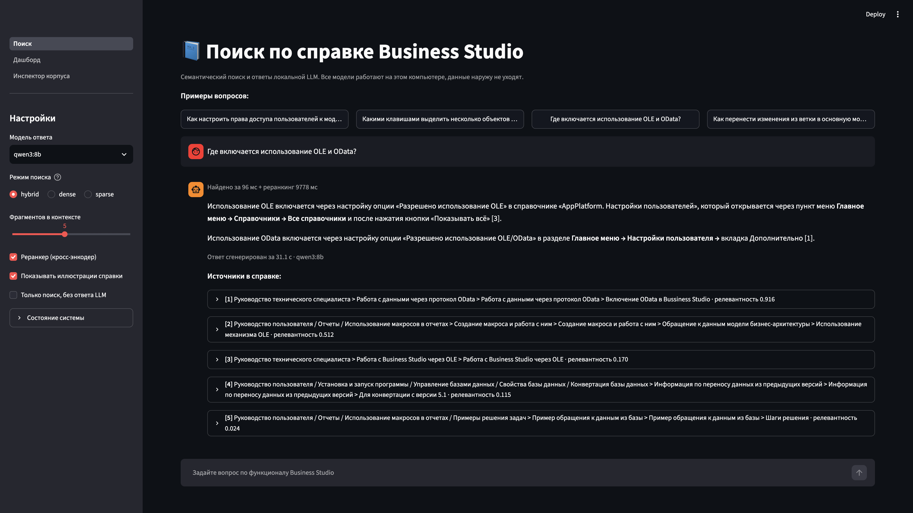
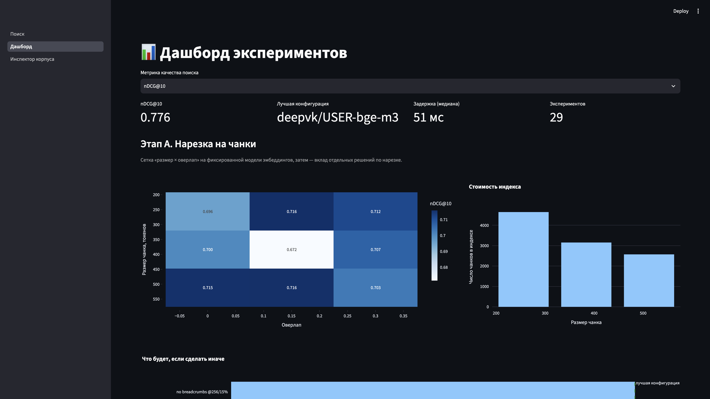
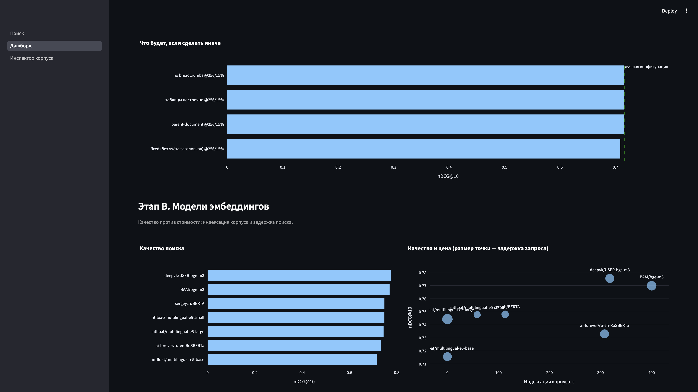
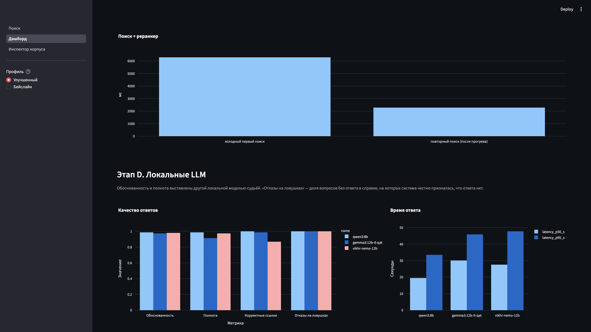
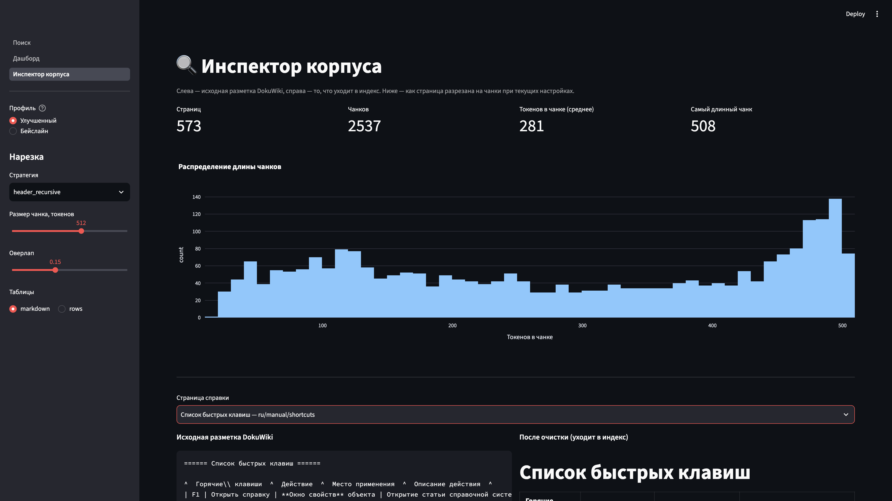

# bs-semantic

Локальный семантический поиск и RAG по официальной справке Business Studio. Всё крутится on-premise: эмбеддинги, векторный индекс, реранкер и LLM не отправляют текст во внешние API.

Проект сделан как демо для тестового задания: система отвечает на каверзные вопросы по функционалу программы и показывает, из каких файлов справки взят ответ. Выбор чанкинга, модели эмбеддингов и схемы поиска обоснован бенчмарками (`bsrag bench`, дашборд в UI).

## Архитектура

```
DokuWiki (.txt)  →  очистка разметки  →  чанки  →  Qdrant (dense + BM25)
                                                      ↓
вопрос  →  гибридный поиск + RRF  →  кросс-энкодер  →  локальная LLM (Ollama)
                                                      ↓
                              ответ со ссылками [1][2] и путём к файлу справки
```

| Слой | Что взяли | Зачем |
|---|---|---|
| Парсер | свой `dokuwiki2md` (~200 строк) | Готовых парсеров под плагины Business Studio нет |
| Чанкинг | LangChain `MarkdownHeaderTextSplitter` + `RecursiveCharacterTextSplitter` | Режем по оглавлению справки, не по «каждые N символов» |
| Эмбеддинги | `deepvk/USER-bge-m3` | Лучший nDCG и Hit@3 на каверзных вопросах среди 7 моделей |
| Индекс | Qdrant embedded | Dense + sparse BM25 в одной коллекции, RRF из коробки |
| Реранкер | `BAAI/bge-reranker-v2-m3`, fp16 на MPS | Поднимает точные попадания по кнопкам и пунктам меню |
| LLM | Ollama: Qwen3 8B / Gemma3 12B QAT / Vikhr-Nemo 12B | Полностью локальный инференс, ответы только по фрагментам |
| Оценка | `ranx` (nDCG, MRR, Hit@k) + локальный LLM-судья | Сравнение стратегий без облачных API |
| UI | Streamlit | Поиск, дашборд экспериментов, инспектор чанков |

Парсер справки написан вручную: готовые конвертеры DokuWiki не понимают плагины Business Studio. Остальной пайплайн собран из LangChain, Qdrant, FastEmbed и Ollama. В парсере отдельно разобраны `{{bslink>…}}`, `<startTableBox>`, объединение строк `:::`, подписи рисунков и возврат шапки таблицы оторванным чанкам.

## Что сломалось бы без своего парсера

Справка — это DokuWiki с самописными плагинами Business Studio, не «чистый markdown».

- **`{{bslink>Главное меню → Отчеты → …\|ShowRibbonPageOrItem?GUID}}`** — видимый текст это путь по меню, после `|` GUID. Наивная очистка выкидывает ровно то, по чему ищут «где это включается».
- **`<startTableBox>…<endTableBox|Таблица 1. …>`** — подпись стоит *после* таблицы. При нарезке она отрывается, а таблица рвётся посередине.
- **`:::`** в таблице горячих клавиш — объединение строк. Без наследования F1/Ctrl+R остаются только у первой строки.
- Картинки `[{{ path\|Рисунок 1. … }}]`: файл не нужен эмбеддеру, подпись — нужна.
- BOM у 51 страницы прятал заголовок первого уровня.
- `[<contextnavigator>]`, YouTube-iframe, страницы-оглавления из одних ссылок.

После очистки: 573 рабочие страницы, ~2.5 млн символов, остатков разметки нет.

## Запуск

Нужны Python 3.11–3.12, [uv](https://docs.astral.sh/uv/), [Ollama](https://ollama.com/) и ~20 ГБ на диск под модели.

```bash
git clone https://github.com/<you>/bs-semantic.git
cd bs-semantic
uv sync --extra dev

# Полный комплект справки положите в bs_6/docs/data/pages
# (или работайте на выборке из репозитория)
# configs/sample.yaml указывает на data/sample_corpus

ollama pull qwen3:8b
# опционально:
# ollama pull gemma3:12b-it-qat
# ollama create vikhr-nemo-12b -f models/vikhr-nemo.Modelfile

uv run bsrag doctor
uv run bsrag ingest                 # DokuWiki → Markdown
uv run bsrag index                  # чанки + Qdrant
uv run bsrag ask "Какой горячей клавишей вызвать окно Права доступа?"
uv run bsrag ui                     # http://localhost:8501
```

На выборке из репозитория:

```bash
uv run bsrag ingest --config configs/sample.yaml
uv run bsrag index --config configs/sample.yaml
uv run bsrag ask --config configs/sample.yaml "Как открыть окно фильтра?"
```

Первый `index` скачивает эмбеддинг-модель с Hugging Face (дальше всё локально).

## Интерфейс

`uv run bsrag ui` поднимает Streamlit на http://localhost:8501. В сайдбаре переключатель **Бейслайн / Улучшенный**: бейслайн — `configs/baseline.yaml` и исходный индекс, улучшения его не затирают. Три страницы:

- **Поиск** — вопрос, ответ локальной LLM и цитаты с путём к файлу справки.
- **Дашборд** — графики `reports/benchmarks.csv`: нарезка, эмбеддинги, схема поиска, LLM.
- **Инспектор корпуса** — исходный DokuWiki, очищенный markdown и чанки одной страницы.











## Команды

| Команда | Назначение |
|---|---|
| `bsrag ingest` | Очистка разметки, `data/processed/pages.jsonl` |
| `bsrag index` | Нарезка и индекс |
| `bsrag search "…"` | Только поиск, без LLM |
| `bsrag ask "…"` | Ответ со ссылками на файлы справки |
| `bsrag chat` | Диалог в терминале |
| `bsrag goldset` | Собрать золотой набор вопросов |
| `bsrag bench [chunking\|embeddings\|retrieval\|llm\|ablations\|improve\|warmup\|goldset_expand\|all]` | Эксперименты → `reports/benchmarks.csv` |
| `bsrag ui` | Streamlit |
| `bsrag doctor` | Проверка окружения |

## Как ставили эксперимент

Полный перебор «нарезка × модель × поиск × LLM» стоил бы десятков часов и смешал бы эффекты. Поэтому **один фактор за этап**: меняем одну группу параметров, остальное фиксируем на лучшем известном значении. Реранкер на этапе чанкинга выключен — иначе он сглаживает разницу между нарезками.

Метрики поиска — **page-level** nDCG@10, MRR@10, Hit@k (`ranx`). Оценка по странице, не по чанку: иначе 256 и 512 несравнимы. LLM меряем отдельно: обоснованность/полнота (локальный судья), корректность ссылок, отказ на ловушках, p50/p95.

Цифры этапов A–E ниже — с того goldset, на котором принимали решения (24 ручных + 40 авто). Финальное сравнение профилей — на **76 ручных**, без синтетики. Оба набора оставлены в тексте специально: так видно, что именно переоценили.

### Этап 0. Парсер

**Идея.** Готовый dokuwiki→md не знает плагины Business Studio.

**Гипотеза.** Если выкинуть разметку «как HTML», пропадёт то, по чему ищут: путь меню, клавиша, подпись таблицы.

**Эвристики.** `{{bslink>…|GUID}}` — оставить видимый путь, не GUID. `:::` — наследовать значение ячейки вниз. Подпись `<endTableBox>` и подпись рисунка — в текст, файл картинки — нет. BOM с 51 страницы снять, иначе пропадает H1. Оглавления из одних ссылок выкинуть.

**Метрика этапа.** Не nDCG, а тесты на живых конструкциях + инспектор корпуса.

**Решение.** Свой парсер (~200 строк). Остальной пайплайн — библиотеки.

### Этап A. Чанкинг

**Идея.** Резать по оглавлению справки, не «каждые N символов». LangChain: `MarkdownHeaderTextSplitter` + `RecursiveCharacterTextSplitter`. Бюджет токенов минус шапка раздела; оторванной таблице возвращаем заголовок колонок.

**Гипотезы.** (1) 256 лучше 512 на каверзных. (2) оверлап 15% лучше 0% и 30%. (3) parent-document / rows / отказ от крошек дадут плюс.

**Протокол.** Сетка 256/384/512 × 0/15/30% на `e5-base`, без реранкера. Потом абляции на отдельных коллекциях (`force_index`). Имя коллекции кодирует strategy / table_mode / breadcrumbs — общий `pages.jsonl` больше не переиспользуется.

**Цифры.** 256/15% чуть лучше на ручных (manual nDCG 0.60). 512/15% — тот же общий nDCG при меньшем индексе → **оставляем 512/15%**. Абляции после изоляции: fixed 0.709 (заголовки нужны), parent-document 0.716 (тот же embed-текст, меняется только контекст LLM), rows 0.731, no breadcrumbs 0.731.

**Первый прогон абляций был сломан** (все 0.716 — читали одну коллекцию). Пересчитали. Это оставляем в отчёте.

**Решение.** Header-aware 512/15%, markdown. Крошки в эмбеддере выключим позже, на USER-bge-m3.

### Этап B. Эмбеддинги

**Идея.** Сравнить модели на фиксированной нарезке 512/15%, без реранкера.

**Гипотеза.** Русскоязычный `deepvk/USER-bge-m3` лучше e5-large и лучше универсального bge-m3 на этой справке.

**Цифры.** USER-bge-m3: nDCG 0.78, Hit@3 0.89. e5-large: 0.74 / 0.83. Ванильный bge-m3 ниже USER. У e5/RoSBERTa обязательны префиксы query/passage.

**Решение.** USER-bge-m3. Qdrant не меняем: на ~2500 чанках ANN не определяет качество.

### Этап C. Схема поиска

**Идея.** Dense + BM25 в одной коллекции, RRF из коробки, затем кросс-энкодер.

**Гипотезы.** Hybrid лучше dense и BM25. Реранкер даст основной скачок Hit@3. 32 кандидата лучше 16. Свои веса «короткий запрос → BM25» лучше равного RRF.

**Цифры на e5-large.** Dense: Hit@3 0.75. Dense+реранкер: 0.92. Hybrid+реранкер: Hit@1 0.71. BM25 один: Hit@1 0.33. 32 кандидата: Hit@3 +0.015, nDCG −0.013, 4.6 с — **не берём**. Взвешенный RRF: nDCG 0.80 → 0.78 — **не берём**, на 24 примерах веса не учили.

**Эвристика, которая выжила.** Лексическое раскрытие без LLM («клавиш» → «горячая клавиша»): +0.002 nDCG, +0–50 мс.

**Решение.** Hybrid + реранкер, 16 кандидатов, лексическое раскрытие.

### Этап D. LLM

**Идея.** Ответ только по фрагментам, цитаты `[1][2]`, отказ если в справке нет. `think: false`.

**Гипотеза.** Более крупная модель даст лучшие ответы. Ограничение: отказы важнее полноты.

**Цифры.** Qwen3 8B: ~24 с, citation 1.0, trap 1.0. Gemma3 12B полнее и медленнее, иногда отвечает вне справки. Vikhr слабее по cited_gold.

**Решение.** Qwen3 8B. Прогрев UI убирает холодный старт поиска (6.1 → 2.2 с), не 24 с генерации.

### Этап E. Таблицы и бейслайн

**Идея.** Header-aware режет таблицу посередине. Даже с возвратом шапки «Ctrl+R» тонет среди соседних строк.

**Гипотеза.** Вторая коллекция *строк* таблиц даст больше, чем ещё одна эмбеддинг-модель. Весь корпус в `rows` — хуже, чем dual-index.

**Цифры на 24+авто.** Dual-index: nDCG 0.819, Hit@1 0.75, Hit@3 0.875. Весь корпус в rows: 0.813. Взвешенный RRF снова хуже.

**Решение на этом этапе.** Dual-index включён в улучшенный профиль. Бейслайн заморожен (`configs/baseline.yaml` + отдельная коллекция + `reports/benchmarks_baseline.csv`), чтобы улучшения можно было показать рядом, не «вместо».

### Этап F. Расширение ручного goldset

**Идея.** 24 ручных — это не оценка, а ориентир. Один Hit@1 = +4 пункта.

**Гипотеза.** На 60–80 вопросах, написанных по страницам, а не генератором из чанка, «выигрыш» улучшений либо подтвердится, либо окажется шумом.

**Протокол.** 76 ручных (70 уникальных страниц: портал, HTML, ССП, нотации, ветки, СМК, риски, мультиязычность) + 12 ловушек. Синтетику из чанков в это сравнение не мешаем. `bsrag bench goldset_expand`.

**Цифры только по 76 ручным:**

| | Hit@1 | Hit@3 | nDCG@10 | MRR@10 |
|---|---|---|---|---|
| Бейслайн | **0.750** | 0.855 | **0.832** | **0.822** |
| Улучшенный | 0.737 | **0.868** | 0.803 | 0.805 |

Ранг эталона совпал на **69/76**. Старый скачок nDCG 0.80→0.819 на 24+авто не воспроизводится. Стандартная ошибка Hit@1 при p≈0.75: на 24 вопросах ±9 п.п., на 76 — ±5.

**Решение.** Оба профиля оставляем. Улучшенный — по умолчанию (Hit@3, узкие факты из таблиц). Бейслайн — в UI. Решение не крутим дальше: см. ниже, почему стоп.

## Честность эксперимента

Это не «подогнали цифру и остановились». Протокол фиксировали до интерпретации.

- **Одна ось за этап.** Иначе нельзя сказать, что сработало.
- **Эталон не из выдачи.** Страницы в `manual.yaml` проставлены по тексту справки. Вопросы — пользовательские, не копипаст заголовка.
- **Синтетика отделена.** Авто-вопросы из чанка завышают nDCG (слова вопроса уже есть в чанке). Финальное сравнение профилей — только 76 ручных.
- **Бейслайн не затирается.** Отдельный yaml, отдельная коллекция, снимок CSV. Улучшение, которое нельзя показать рядом с исходным, — не улучшение.
- **Отрицательные результаты не выкинуты.** 32 кандидата, взвешенный RRF, весь корпус в `rows`, parent-document «ради эмбеддера» — измерены и отвергнуты.
- **Сломанный прогон не спрятан.** Первые абляции parent/rows/nobc дали одинаковые 0.716, потому что читали одну коллекцию. Изолировали, пересчитали, написали об этом.
- **Не учили fusion на goldset.** 24 (и даже 76) примеров — переобучение. Эвристика проиграла равному RRF Qdrant.
- **Метрика page-level.** Система может попасть в верную страницу и всё равно ответить не из той строки. Это названо, не замаскировано.
- **LLM-судья — локальная модель**, не человек. Citation 1.0 ≠ «идеальный ответ».

Что этим *не* доказано: что улучшенный профиль лучше бейслайна на всех метриках (на 76 ручных они в пределах шума); что ответ LLM читает нужную строку таблицы; что цифры воспроизведутся на полном дампе у другого человека без корпуса в git.

## Почему остановились здесь

Не потому что «больше нельзя», а потому что следующий шаг уже не меняет решение, которое можно защитить за 20 минут.

1. **Качество поиска вышло на плато.** На 76 ручных бейслайн и улучшенный расходятся на ~1 вопрос. 69/76 — тот же ранг эталона. Ещё одна модель эмбеддингов может дать 0…+0.04 nDCG, как e5→USER, или минус. Это лотерея на часы индексации, не новый тезис.
2. **Учить что-либо на 76 примерах нельзя.** Fusion, реранкер, пороги — переобучение. Мы это уже видели на взвешенном RRF.
3. **LLM-rewrite и агент** добавят 2–4 с и риск сломать ловушки. Задание — поиск по справке со ссылками, не ассистент.
4. **Смена Qdrant на FAISS/pgvector** не поднимет nDCG: на 2500 чанках поиск полный. Qdrant выбран за dense+BM25+RRF в одном процессе.
5. **24 с генерации** — инференс 8B, не баг индекса. Лечится UX (сначала источники, LLM по кнопке), не новой архитектурой. До сдачи это косметика, не доказательство.
6. **Есть что показать честно:** парсер, однофакторные бенчи, отвергнутые гипотезы, замороженный бейслайн, расширенный goldset, который *опроверг* часть ранних выигрышей.

Дальше — если будет «прод»: Qdrant server (UI и bench не дерутся за lock), 150+ ручных, search-first UI, более быстрый реранкер. Это не входит в замороженное демо.

| | Бейслайн | Улучшенный (по умолчанию) |
|---|---|---|
| Конфиг | `configs/baseline.yaml` | `configs/default.yaml` |
| Коллекция | `…_512_15_markdown` | `…_512_15_markdown_nobc` + `_tables` |
| Крошки в эмбеддере | да | нет |
| Раскрытие запроса | нет | да |
| Индекс таблиц | нет | да |
| Прогрев UI | нет | да |

Переключение в сайдбаре UI или `uv run bsrag ask --config configs/baseline.yaml "…"`.

## Структура

```
src/bsrag/           ядро: парсер, чанкинг, индекс, RAG, CLI
app/                 Streamlit: поиск, дашборд, инспектор корпуса
configs/             default.yaml (улучшенный), baseline.yaml, sample.yaml
docs/                план презентации и скриншоты UI
reports/             benchmarks.csv и снимок benchmarks_baseline.csv
data/goldset/        ручная разметка (manual.yaml); goldset.jsonl в git не входит
data/sample_corpus/  небольшая выборка справки для воспроизведения демо
tests/               разметка DokuWiki, плагины, лексическое раскрытие
scripts/             выгрузка выборки, дымовые прогоны
```

Полный корпус справки в git не кладётся (проприетарный контент). Для демо в репозитории — 25 страниц, покрывающих таблицы, `bslink`, горячие клавиши и типичные каверзные вопросы.

## Лицензия

Код — MIT. Тексты и иллюстрации справки Business Studio принадлежат правообладателю и в публичный репозиторий не входят, кроме явно указанной учебной выборки.
